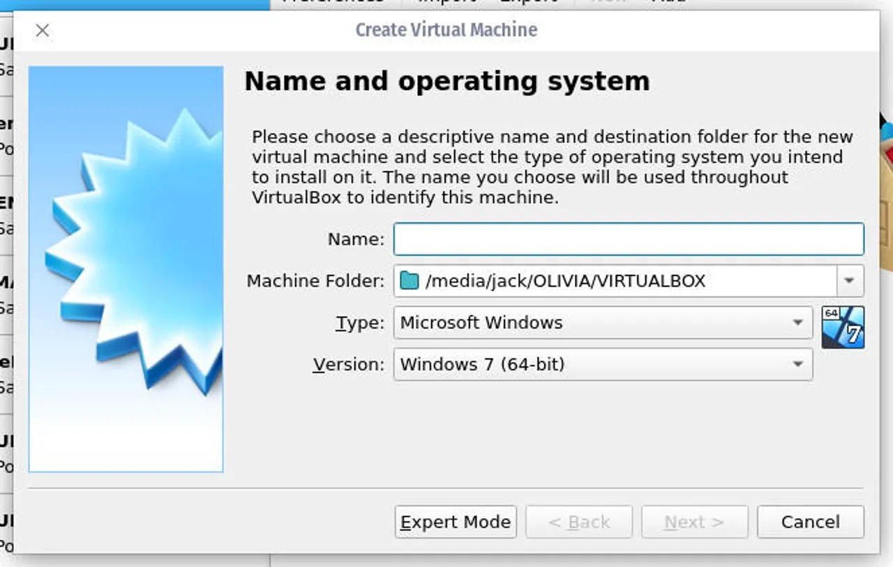
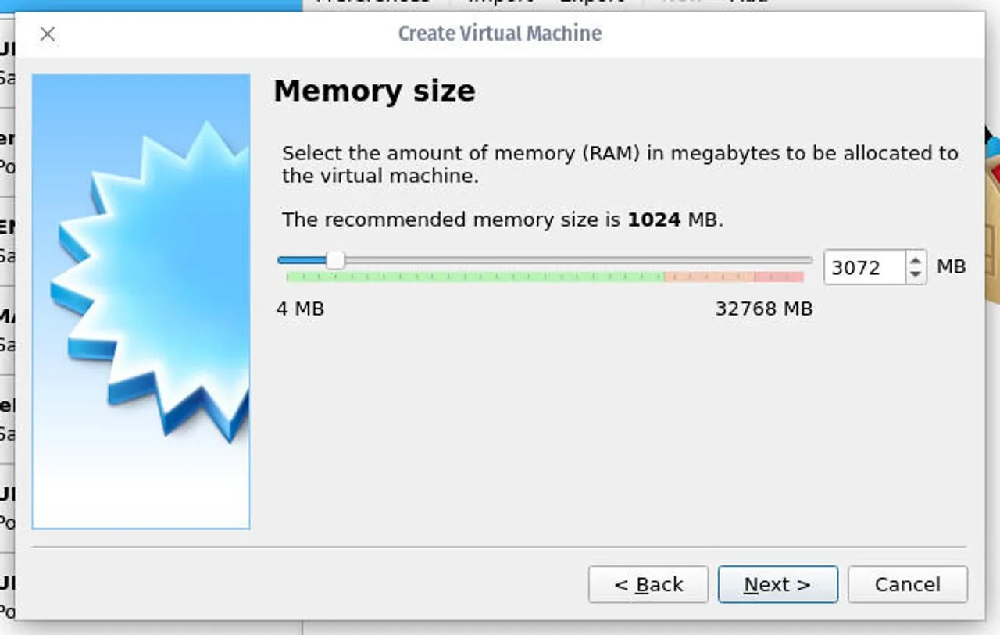
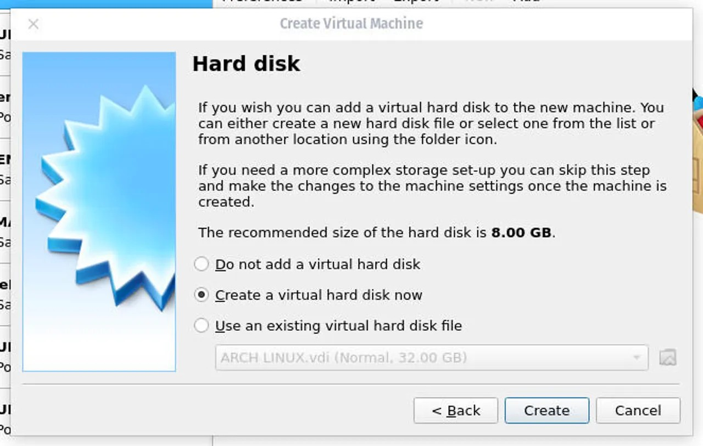
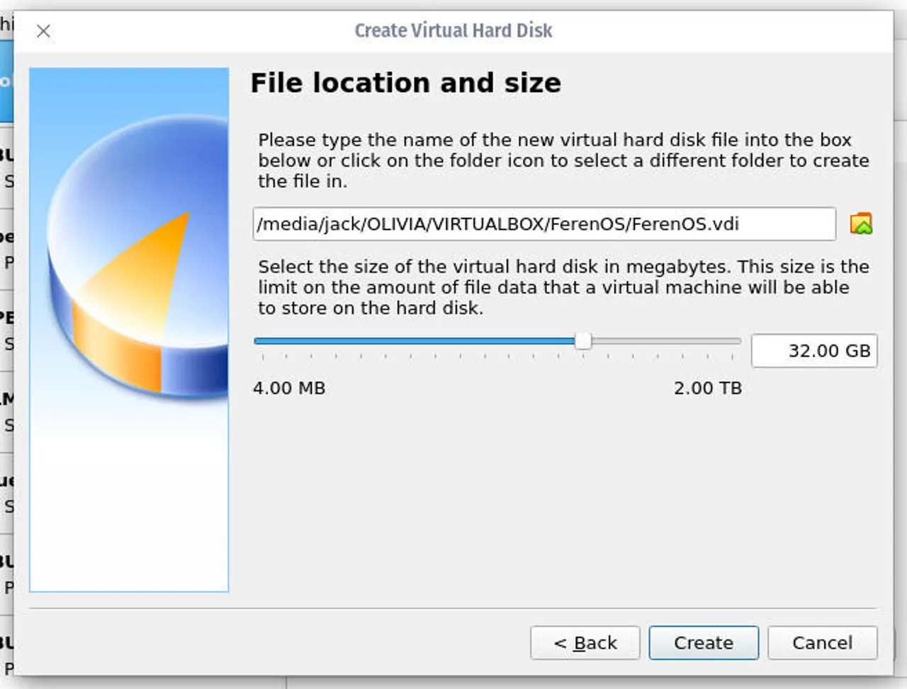
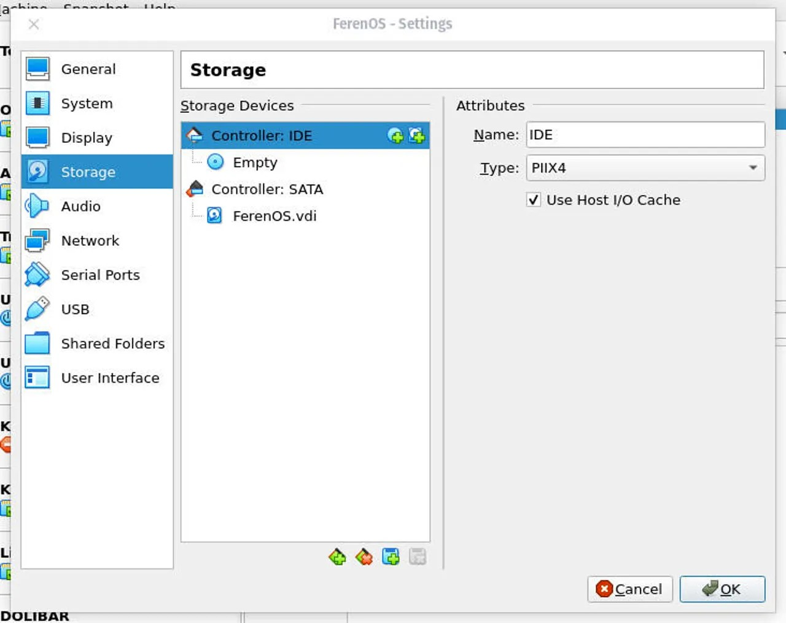
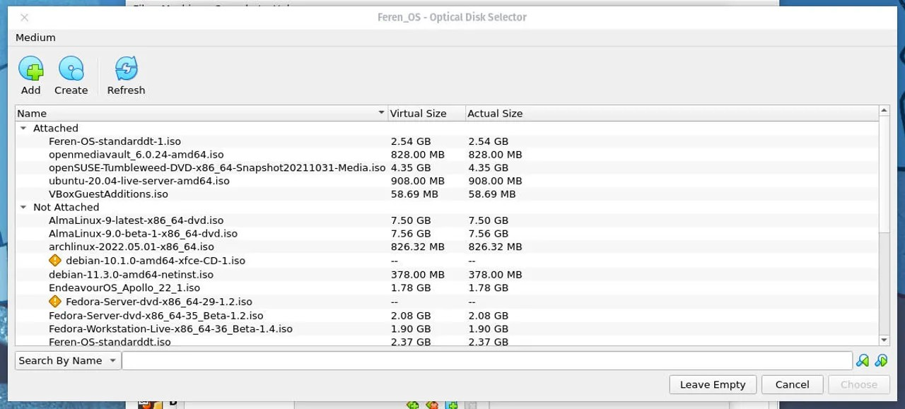

<h1>I will walk you through the process of creating a Linux virtual machine with VirtualBox.</h1>

<i>Creating the virtual machine</i>

<h2>Open VirtualBox</h2>
First, you'll open VirtualBox from your computer's desktop menu. Once the application is open, click Tools and then click New

The VirtualBox main window.
The VirtualBox main window shows I've already created quite a few virtual machines.

<h2>Name your new guest operating system</h2>
I'm going to spin up a virtual machine for FerenOS, which is a Linux distribution. In the first window of the wizard (Figure 2), give the virtual machine a name, select the folder to house the files, select the type of operating system for the new virtual machine and the version, and then click Next.

The VirtualBox virtual machine naming window.
Naming our new virtual machine.

<h2>Configure RAM</h2>
In the next window, slide the Memory size slider to the right to increase the amount of RAM you want to allot to the machine.

 

The VirtualBox virtual machine memory resizer.
Configuring the RAM for our new virtual machine.

<h2>Create a virtual hard disk</h2>
Click Next and, in the resulting window (Figure 4), click Create to create a new virtual hard disk.

The VirtualBox disk creation window.
Creating a new virtual hard drive for our guest OS.

In the next two windows, select VDI and then Dynamically allocated. In the final window, slide the slider to the right to increase the size of the virtual hard disk to however large you need, and make sure to select the folder to house the drive.

The VirtualBox virtual disk resizing tool.

Click Create and you'll be returned to the VirtualBox main window.

<h2>Configure your guest operating system</h2>
We can now configure our guest operating system. One thing you'll want to make sure to do (before you take this step) is to download the ISO file for the version of Linux you want to install.

1. Add the ISO image for installation
Select the virtual machine you just created from the left pane and then click Settings. In the resulting window, click Storage and then click the left + associated with Controller: IDE.

The VirtualBox Settings window.
This is where you configure all aspects of your virtual machine.

In the resulting window, click Add, and when your file manager opens, navigate to wherever it is you saved the ISO image for the Linux distribution you downloaded.

The VirtualBox image selector.
Adding an ISO image for installation.

Once you've selected your ISO image, click Choose and then OK. You should now find yourself back at the VirtualBox main window, where you're ready to run the virtual machine.

<h2>Start the installation</h2>
Select the virtual machine you just created in the left navigation and click the Start button, which will launch the bootable image and -- depending on the Linux distribution you've chosen -- should land you at either the live image (where you can either test or install the guest operating system) or immediately install the guest.

FerenOS is ready to install as a virtual machine.
You can now install Linux as your guest operating system.
Image: Jack Wallen
Make sure to go through the full installation process for the guest operating system you've chosen. In most cases, that will require clicking the Install icon on the desktop.

Congratulations, you just created your first virtual machine with Linux as a guest operating system. Enjoy kicking the tires of your new open-source platform.
