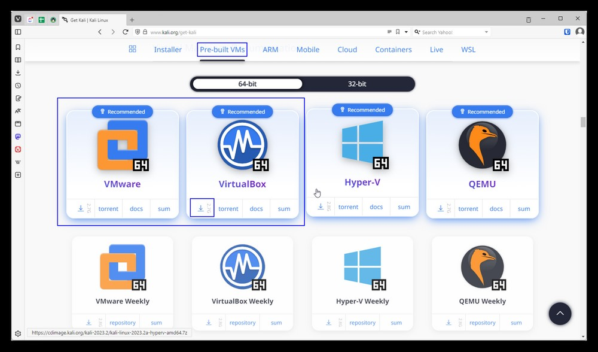
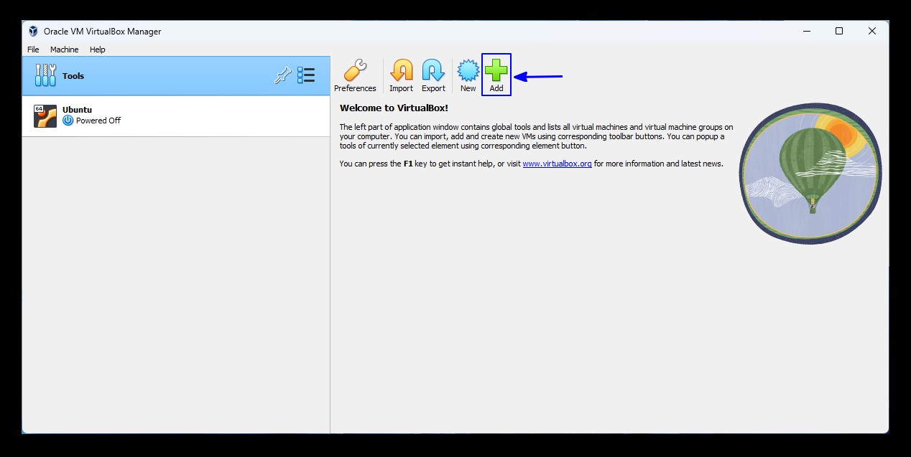
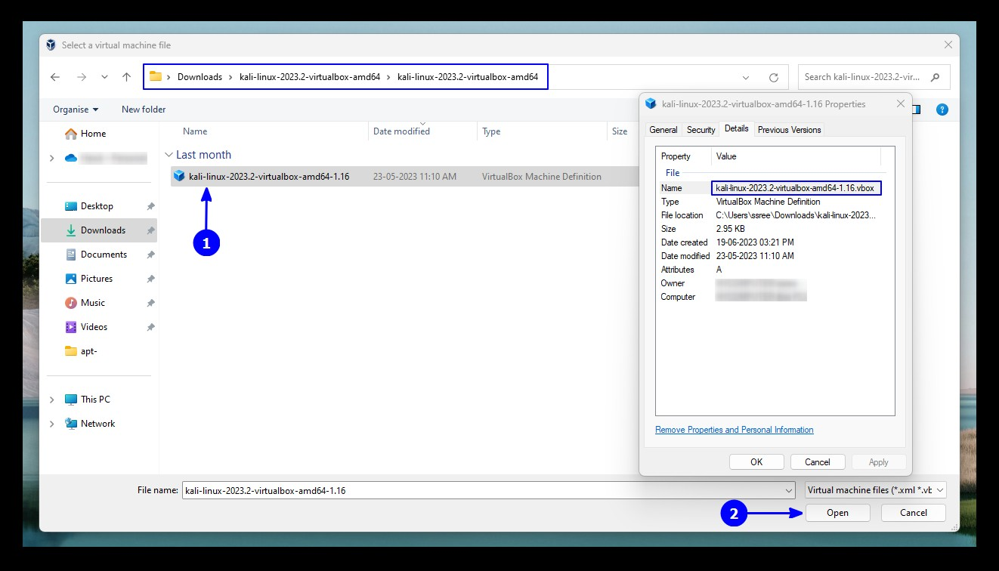

<h1>Step-by-Step Guide to Install Kali Linux on VirtualBox</h1>

<i>We are going to use a custom Kali Linux image made specifically for VirtualBox.</i>

<h2> Download ready-to-use virtual image of Kali Linux </h2>
After installing it successfully, head to the Kali Linux download page to download the VM image for VirtualBox. If you change your mind about utilizing VMware, that is available too.

Download the virtual machine-specific image of Kali Linux from the official website
Download Kali Linux Virtual Machine Images
As the file size is around 3 GB, you should use the torrent option or download it using a download manager, whichever is fastest for you.

<h2>Install Kali Linux on Virtual Box</h2> 
Once you have installed VirtualBox and downloaded the Kali Linux 7z image, you need to add it to VirtualBox to make it work.

Here’s how to add the VirtualBox image for Kali Linux:

<h3>Step 1</h3>: Extract the downloaded 7z file. You can use 7zip to extract the file.

The Kali Linux Virtual Machine storage will be in the same location as you extracted the 7z file. If you want a different location for the VM, you need to extract the 7z file to a location where you have sufficient storage available. I would never recommend the C: drive on Windows.

<h3>Step 2</h3>: Launch VirtualBox. You will notice an Add button – click on it.

Click on the Add button in the VirtualBox Welcome screen
Select Add button
<h3>Step 3</h3>: Next, browse the folder you just downloaded and extracted. Choose the VirtualBox Machine Definition file to be added (as you can see in the image below). The file name should start with ‘kalilinux‘ and end with the .vbox extension.

Open the .vbox file in VirtualBox
Add Kali Linux
Once selected, proceed by clicking on Open.

<h3>Step 4</h3>: Now, you will be shown the settings for the virtual machine you are about to add. So, you can customize them or not – that is your choice. It is okay if you go with the default settings.

Start the Kali Linux Virtual Machine with default settings

Start Kali Linux
Here, the hard drives as VDI refer to virtually mounting the hard drives by allocating the storage space set.

After you are done with the settings, hit Start and wait for a while.

You might get an error at first for USB port 2.0 controller support, you can disable it to resolve it or just follow the on-screen instructions of installing an additional package to fix it. And, you are done!

Enter the username and password for Kali Linux on the login screen. The default username and password is "kali"
Kali Linux Login Screen

The default username in Kali Linux used to be root and the default password was toor. But since January 2020, Kali Linux has not using the root account.

Now, the default account and password both are Kali.

You should be able to log in to the system with it.

Kali Linux is running inside VirtualBox.
Kali Linux Desktop in VirtualBox
Do note that you should update Kali Linux before trying to install new applications or trying to hack your neighbor’s WiFi.

